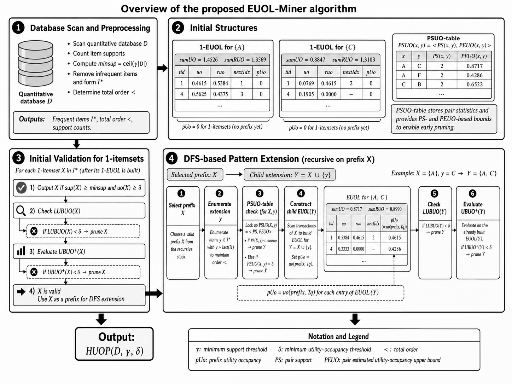

Mining Frequent Patterns with EUOL-Miner
This is the official source code for the paper: EUOL-Miner: Efficient High Utility
Occupancy Pattern Mining Using Extended Utility Occupancy Lists and Dual Pruning Strategies

1. System Requirements
Python 3.8+, Java

Libraries: pandas, numpy, matplotlib

Quick install: pip install -r requirements.txt

2. Repository Structure
/src: Contains the source code for the algorithms (HUOMIL, EUOL-Miner_Base, EUOL-Miner_Dual...).

/data: Contains experimental datasets.

/plot_scripts: Contains the scripts used to generate the plots in the paper.

3. How to Run
Running the algorithm:
To run MinerDual on the T10I4D200K dataset with gamma=0.05 and delta=0.25, execute:
python src/MinerDual.py --input data/T10I4D200K.csv --gamma 0.05 --delta 0.25

4. Reproducing the figures:
To regenerate the comparison plots for execution time and memory usage (Figure 8 in the paper), run:
python plot_scripts/8.py
The output plots will be saved in the /figures directory.

5. Experimental Results
As shown in the figure below, MinerDual significantly outperforms the baseline algorithms in terms of runtime:

fig2
